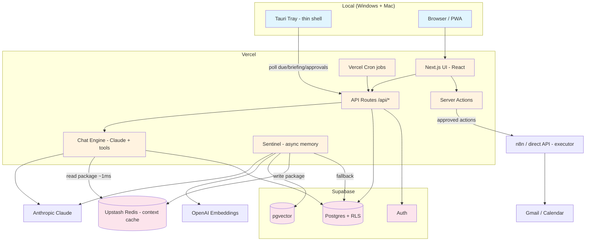

# Coriven — System Architecture

> Synthesized from the master blueprint (§4–§14, §20) and verified against the as-built code. The blueprint governs on conflict. Note: the blueprint's templates assume Azure; **Coriven runs on Vercel + Supabase + Upstash**, not Azure — this document reflects the actual stack.

## Document Overview

### Purpose

Define the system architecture: components, data model, integrations, security, performance, and operations — the technical contract the implementation must satisfy.

### Scope

The Next.js cloud app (UI + API + chat engine + Sentinel), the Tauri tray, Supabase (Postgres + Auth + RLS + pgvector), Upstash, Vercel Cron, and the n8n worker. Excludes deferred architectures (graph memory, local LLM, MCP exposure).

### Audience

Owner/developer; future contributors.

## Executive Summary

### Architecture Overview

Two processes: a **Next.js app on Vercel** (web UI, REST API routes, Server Actions, the Claude chat engine, the async Sentinel) and a **local Tauri tray** (thin shell that polls API endpoints and fires native notifications). State lives in **Supabase** (Postgres, Auth, RLS, pgvector) with **Upstash Redis** as the Sentinel context cache. **Vercel Cron** drives briefings, email polling, and pattern detection. Approved external actions execute through **n8n (or direct API calls)** — never triggered by untrusted content.

### Key Architectural Decisions

1. **Decision**: API-first, auth + `user_id` + RLS from day one.
   - **Rationale**: personal→product without a rewrite; free multi-tenancy.
   - **Alternatives**: direct DB access from UI; single-tenant. **Trade-offs**: slightly more boilerplate now for zero migration later.

2. **Decision**: Supabase Postgres + pgvector (not SQLite, not a dedicated vector DB).
   - **Rationale**: one stack, RLS guarantees, sufficient at per-user scale.
   - **Alternatives**: Pinecone/Weaviate/Qdrant; Neo4j/Graphiti. **Trade-offs**: pgvector gives ~80% of value at far less complexity now; graph deferred.

3. **Decision**: The Sentinel — async memory builder that reads from stores, not a context window; chat reads a pre-built package (~1ms).
   - **Rationale**: removes the context cliff; the genuinely novel differentiator.
   - **Alternatives**: synchronous in-prompt assembly (the Memory MVP, shipped first as 2a). **Trade-offs**: adds Upstash + async; mitigated by Supabase fallback.

4. **Decision**: Tauri tray now (replaces the Node.js daemon).
   - **Rationale**: a port would rewrite ~100% of the daemon; Tauri yields Windows + Mac from one codebase; logic lives in the API.
   - **Alternatives**: extend Node.js daemon; Electron. **Trade-offs**: signing/notarization cost accepted now.

5. **Decision**: n8n as a replaceable worker, not the backbone.
   - **Rationale**: workflow-only architectures become fragile monoliths. **Trade-offs**: can start with direct API calls (§19.4) and swap n8n in later — approval UI is identical.

### Technology Stack Summary

- **Cloud platform**: Vercel (web/API/cron) + Supabase (DB/Auth) + Upstash (cache).
- **AI services**: Anthropic Claude Sonnet (chat) + Haiku (extraction/triage); OpenAI embeddings.
- **Database**: Supabase Postgres + pgvector.
- **Languages**: TypeScript (strict) end-to-end; Rust (Tauri core).
- **CI/CD**: GitHub → Vercel auto-deploy from `main`; CI builds signed Tauri artifacts.

## System Context

### Business Context

Coriven is a personal Life OS engineered for productization. The architecture's job is to make compounding memory reliable and external actions safe.

### Technical Context

Greenfield monorepo; same Vercel/Supabase account family as MealPrepForge. No legacy system to integrate — the only "current system" is Coriven's own Phase 1 build.

### System Boundaries

#### In Scope

- [x] Next.js app (UI, API, chat engine, Sentinel).
- [x] Supabase (Postgres, Auth, RLS, pgvector).
- [x] Tauri tray; Upstash; Vercel Cron; n8n worker; Stripe (Phase 6).

#### Out of Scope

- [ ] Graph/bi-temporal memory store (deferred).
- [ ] Local LLM; MCP server exposure; native mobile (Capacitor).

### External Dependencies

| Dependency | Type | Purpose | SLA target | Risk |
|---|---|---|---|---|
| Anthropic Claude | AI | chat + extraction | provider | Medium |
| OpenAI Embeddings | AI | vectorize memories | provider | Low |
| Supabase | DB/Auth | data + auth + pgvector | provider | Medium |
| Upstash Redis | Cache | Sentinel package | provider | Low (fallback exists) |
| Vercel | Hosting/Cron | app + scheduled jobs | provider | Medium |
| Gmail / Calendar | SaaS API | comms (Phase 4) | provider | Medium |
| Stripe | Payments | billing (Phase 6) | provider | Low |

## High-Level Architecture

### Architecture Style

Modular monolith (Next.js) with serverless functions and scheduled jobs; async memory pipeline (the Sentinel); approval-gated side effects through a replaceable worker. Capabilities are small and independently testable (not one workflow chain).

### System Architecture Diagram



### Core Components

#### Component: Chat Engine (`apps/web/src/lib/chat/engine.ts`)

- **Purpose**: Drive the Claude tool-use loop.
- **Responsibilities**: load context (Sentinel package or inline memory) + enabled tools; stream Sonnet; execute tool calls via `tools/handlers`; persist to `conversation_messages`; trigger the Sentinel async.
- **Technology**: Anthropic SDK streaming (SSE); TypeScript.
- **Interfaces**: `POST /api/chat`; tool registry (`tools/registry.ts`).
- **Scaling**: stateless serverless.

#### Component: Sentinel (`apps/web/src/lib/memory/`)

- **Purpose**: Build the context package asynchronously.
- **Responsibilities**: extract entities/facts (Haiku); embed (OpenAI); search stores; judge/compress/expand; write package to Upstash + `sentinel_context` fallback. Fires on user AND assistant messages.
- **Interfaces**: invoked post-turn; chat reads the cache.
- **Scaling**: async; latency hidden by inter-message gaps; previous-package fallback for rapid-fire.

#### Component: Tool Registry & Handlers (`apps/web/src/lib/chat/tools/`)

- **Purpose**: Define and execute tools; enforce permissions.
- **Responsibilities**: filter registry against `tool_permissions` before each Claude call; one handler per tool; JSON-Schema inputs. Grows per phase (memory, goals, comms, proactive tools).

#### Component: Tauri Tray (`apps/tray` → Tauri)

- **Purpose**: Deliver reminders/briefings/approvals without a browser.
- **Responsibilities**: authenticate; poll `/api/tasks/due`, `/api/briefing/today`, `/api/approvals/pending`; render native notifications; call snooze endpoints. **No business logic, no DB access.**
- **Technology**: Rust core + system webview; autostart + notification + secure-storage plugins.

#### Component: Cron Jobs (`apps/web/src/lib/jobs/` + `/api/cron/*`)

- **Purpose**: Scheduled intelligence.
- **Responsibilities**: daily briefing (timezone-aware); email poll (15 min); calendar sync (hourly); pattern detection (nightly); weekly review (Fri 5pm); meeting prep (15 min before). Protected by `CRON_SECRET`.

## Detailed Architecture

### Application Architecture

#### Frontend

- **Framework**: Next.js 15 App Router (React server + client components).
- **State**: server components + local client state; SSE for chat streaming.
- **Styling**: Tailwind CSS 4 (no component library yet; shadcn/ui can layer later).
- **Deployment**: Vercel; `@/*` → `apps/web/src/*`.

#### Backend

- **Framework**: Next.js API routes + Server Actions.
- **Pattern**: thin routes → lib services (`chat/`, `memory/`, `jobs/`); shared types from `@personal-assistant/types`.
- **API design**: REST; SSE for chat.
- **Auth**: Supabase Auth (SSR) with the 4-client pattern: `client.ts` (browser anon), `auth-client.ts` (browser SSR-aware), `auth-server.ts` (server SSR-aware), `server.ts` (service role). Middleware refreshes sessions every request and redirects unauthenticated users.

#### AI Architecture

Model routing: **Haiku** for extraction/entity-classification/email-triage; **Sonnet** for chat reasoning + multi-step tool chains; **OpenAI** for embeddings.

**Memory pipeline (three layers):**
1. **Entity profiles** — always in context (<~500 tokens); the model reasons over these (sister problem).
2. **Semantic memory** — `memories` + pgvector; retrieved by cosine similarity; Mem0 ADD/UPDATE/DELETE/NOOP; contradiction → `superseded_by`.
3. **Conversation summaries** — last 2–3 injected for continuity.

**Sentinel flow:** user message → Sentinel async (extract → query stores → judge → build package → Upstash + Supabase fallback) → main model reads package → responds → Sentinel fires again on the response. **Integration contract:** the chat route MUST read the package before generating; verified in testing. **Fail gracefully:** Upstash down → Supabase package → session context; never blocks.

### Data Architecture

#### Data Flow

```
User message → API → load context (Upstash package | inline memory) + enabled tools
   → Claude (Sonnet) → [tool call → handler → DB → feed back]* → response (SSE)
   → persist conversation_messages
   → Sentinel async: Haiku extract → OpenAI embed → pgvector search → build package → Upstash + sentinel_context
External action: Claude submit_for_approval → approval_queue(pending) → tray notify
   → user approves (Server Action) → audit_log → n8n/direct API → executed
```

#### Data Storage

##### Primary Database (Supabase Postgres)

- **Built**: `profiles`, `tasks`, `task_reminders`, `tool_permissions`, `conversation_messages` (4 migrations applied).
- **Schema design**: relational; every table `user_id uuid NOT NULL REFERENCES auth.users(id) ON DELETE CASCADE` with RLS `USING (user_id = auth.uid())`. SQL-first migrations.
- **Enums**: `task_status`, `task_priority`, `recurrence_type`, `message_role` (+ later `goal_*`, `email_urgency`, `approval_status`, `integration_provider`).

##### Vector Store (pgvector)

- `memories.embedding vector(1536)`; ivfflat index `(lists = 50)`; `match_memories(query_embedding, match_user_id, match_count)` RPC excluding superseded rows.

##### Cache (Upstash Redis)

- `sentinel:context:{user_id}` (TTL-bounded). Durable fallback: `sentinel_context` table.

#### Data Model (by phase)

**Foundation (built):** `profiles`, `tasks`, `task_reminders` (separate table — §7.4), `tool_permissions`, `conversation_messages` (+`conversation_id`).
**Memory:** `entity_profiles` (type person/place/project/thing/resource; `aliases[]`, `last_mentioned`, `mention_count`, `recency_weight`), `memories` (`superseded_by`, embedding), `user_context`, `conversation_summaries`, `sentinel_context`.
**Goals:** `life_areas`, `goals` (why_it_matters, success_metrics, status/confidence/momentum), `projects`, `daily_briefings`.
**Comms:** `integrations` (encrypted tokens), `email_metadata` (no body), `calendar_events`, `approval_queue`, `audit_log` (append-only).
**Proactive:** `detected_patterns`.
**Conditional:** `behavioral_constraints` (rule, rationale, scope, is_locked).

> Full DDL is maintained in `supabase/migrations/` and blueprint §14; types auto-generated to `apps/web/src/types/supabase.ts`.

#### Data Security

- **At rest**: Supabase managed encryption; OAuth tokens AES-256-GCM (`DATA_ENCRYPTION_KEY`), server-side only.
- **In transit**: HTTPS/TLS everywhere.
- **Access control**: per-user RLS; service-role only for system writes (audit, Sentinel fallback).
- **Classification**: personal data; email bodies never persisted.

### Integration Architecture

#### Internal Communication

- Synchronous REST within the app; async memory pipeline post-turn; cron → API.

#### External Integration

| System | Type | Format | Auth | Error Handling |
|---|---|---|---|---|
| Gmail | REST | JSON metadata; on-demand body | OAuth (encrypted) | retry; mark sync failure |
| Google Calendar | REST | JSON | OAuth (encrypted) | retry |
| n8n / direct API | Webhook/REST | validated action descriptor | shared secret | log; status=failed; retry |
| Stripe | REST + webhook | JSON | API key + webhook secret | idempotent webhook |

#### Security invariant

`Untrusted input → Claude (summarize/propose) → User approval → execution`. n8n receives a webhook only after `approval_queue.status = 'approved'`, carrying a pre-validated descriptor — never raw content or raw AI output.

## Infrastructure Architecture

### Cloud Infrastructure

| Service | Purpose | Scaling | Cost control |
|---|---|---|---|
| Vercel | app + API + cron | serverless auto | usage-based; Haiku routing |
| Supabase | Postgres/Auth/pgvector | managed | per-user scale |
| Upstash Redis | Sentinel cache | serverless | TTL bounds memory |
| Anthropic/OpenAI | AI | provider | model routing; bodies not stored |

### Deployment Architecture

| Environment | Purpose | Data | Trigger |
|---|---|---|---|
| Local dev | feature work | local Supabase / sample | manual |
| Production | live | production | push to `main` (auto-deploy) |

> Staging is optional for a solo build; add when beta opens. Branch workflow: `development` active work; `main` production; PR to `main` (never direct).

### CI/CD Pipeline

```
GitHub
├── feature/* → local + preview deploys
├── development → integration
└── main → Vercel production (auto)

Tray: CI builds + signs Tauri artifacts (Windows .exe code-signed; Mac .app notarized via Apple Developer).
Stages: checkout → install → typecheck/lint → build → (tests) → deploy → smoke.
```

## Non-Functional Architecture

### Performance

- **Chat read path**: ~1ms Upstash fetch — no LLM in the read path; only the user-facing Sonnet call costs latency.
- **Sentinel**: ~2–5s async build; hidden by inter-message gaps; previous-package fallback for rapid-fire.
- **DB**: indexes on `(user_id, remind_at)`, `(user_id, conversation_id, created_at)`, ivfflat on embeddings.
- **Budgets**: page load <3s; reminder delivery ≤ poll window (~5 min).

### Scalability

- Stateless serverless functions; per-user data scale; pgvector adequate (<100k rows). Read replicas/sharding not needed at this scale.

### Reliability

- **Graceful degradation**: Sentinel/Upstash failure → Supabase fallback → session context. Tray offline → cached payload.
- **Idempotency**: Stripe webhooks; cron jobs guard against double-fire (`was_delivered`, `last_fired_at`, unique constraints).
- **DR**: Supabase managed backups; `audit_log` append-only.

## Security Architecture

### Security Model

Defense in depth + zero-trust inputs + human-in-the-loop for external effects. (Maps to development-best-practices: authn/authz, encryption, input validation, secrets management, error handling, observability.)

### Authentication & Authorization

- Supabase Auth (email/password + SSR sessions; 4-client pattern). RLS per user. Tier checks in middleware (Phase 6). Tray uses persisted refresh token (Tauri secure storage); productization moves to PKCE OAuth.

### Data Protection

- AES-256-GCM for OAuth tokens; HTTPS in transit; RLS isolation; minimization (no email bodies).

### Application Security

- **Input validation**: approval payloads validated before insert; tool inputs JSON-Schema-typed.
- **Zero-trust**: untrusted content cannot invoke actions.
- **Secrets / anti-hardcoding**: all config via env vars (see Configuration Reference); no secrets in code; `.env.local` never committed (`.env.example` is the template). Service-role key server-only.
- **API security**: cron endpoints gated by `CRON_SECRET`; n8n webhook by shared secret.

### Infrastructure Security

- Managed platforms (Vercel/Supabase/Upstash); least-privilege keys; append-only audit; (conditional) pre-action constraint gate.

## Monitoring & Observability

### Strategy

Structured logging + platform metrics + targeted AI-cost tracking. (development-best-practices: logging, error handling, monitoring.)

### Application Monitoring

- **Logging**: structured logs in API/jobs/Sentinel; log-and-continue on Sentinel/Upstash failure.
- **Metrics**: chat latency, reminder delivery, cron success, approval throughput.
- **Alerting**: cron failures; integration sync failures.

### AI-Specific Monitoring

- **Token/cost**: per-turn cost; Haiku vs Sonnet split; embedding spend.
- **Quality**: memory precision; constraint adherence (vs ~42.5% baseline); supersession correctness.
- **Integration contract check**: assert the chat read consumed a Sentinel package (no dead-code memory).

## Quality Attributes

- **Performance**: ~1ms read path; async memory.
- **Scalability**: per-user serverless.
- **Reliability**: graceful degradation; idempotent jobs.
- **Security**: RLS, encryption, zero-trust, approval gates.
- **Maintainability**: modular libs; shared types; SQL-first migrations; tray as disposable shell.
- **Accessibility**: WCAG 2.1 AA (see UX doc).

## Architecture Decisions (ADRs)

### ADR-001: Supabase + pgvector from day one

- **Status**: Accepted (2026-06-19, reaffirmed 2026-06-24). **Context**: need DB + auth + vectors without a migration. **Decision**: Supabase Postgres + pgvector; RLS multi-tenancy. **Consequences**: no SQLite migration; graph deferred.

### ADR-002: The Sentinel context architecture; MVP first

- **Status**: Accepted. **Context**: context-cliff problem. **Decision**: async Sentinel reading from stores; ship synchronous Memory MVP (2a) first, Sentinel (2b) after. **Consequences**: Upstash dependency with Supabase fallback; novel differentiator.

### ADR-003: Tauri tray replaces the Node.js daemon

- **Status**: Accepted (2026-06-24). **Context**: avoid building tray features twice. **Decision**: Tauri thin shell; logic in the API. **Consequences**: signing/notarization cost; Windows + Mac from one codebase; remove `apps/tray` (Node) at parity.

### ADR-004: Reminders stay a separate `task_reminders` table

- **Status**: Accepted (2026-06-24). **Context**: a "merge into tasks" plan was written but never executed. **Decision**: keep the working separate table. **Consequences**: don't rebuild what works; `getNextOccurrence()` in `packages/types` is the single source.

### ADR-005: n8n as replaceable worker; start with direct API

- **Status**: **Superseded by ADR-013** (2026-07-04). **Context**: avoid a workflow monolith. **Decision (original)**: approval → executor; start with direct Gmail/Calendar calls, swap n8n in later. **Superseded because**: research showed n8n is single-tenant and doesn't scale to a multi-user product; the integration write path now uses direct provider APIs behind Nango (OAuth authority), long-tail connectors deferred to a post-validation epic. The approval-queue → executor pattern this ADR introduced survives — only the "n8n as the eventual worker" clause is retired. See `ADR-013-integration-token-authority.md`.

### ADR-006: OpenAI embeddings alongside Anthropic

- **Status**: Accepted (§19.7). **Context**: cheap, proven embeddings. **Decision**: `text-embedding-3-small` (1536 dims). **Consequences**: a second AI vendor dependency.

## Deployment & Operations

- **Deployment**: auto-deploy `main` → Vercel; rollback via Vercel; DB changes via SQL migrations (`npx supabase db push`), types regenerated.
- **Operational procedures**: monitor cron + integration syncs; incident response = check logs + platform dashboards; backups via Supabase.

## Risk Assessment

### Technical Risks

1. **Risk**: Sentinel writes context the chat never reads (dead code). **Impact**: High. **Probability**: Medium. **Mitigation**: explicit integration-contract test. **Contingency**: inline Memory MVP path remains.
2. **Risk**: `/api/tasks/due` querying a dropped column. **Impact**: reminders silently miss. **Probability**: Present (known bug). **Mitigation**: fix to query `task_reminders`; add a test.

### Operational Risks

1. **Risk**: Tray logic drift (duplicate recurrence math). **Mitigation**: Tauri shell imports `getNextOccurrence` from `packages/types`; no DB access.

### Security Risks

1. **Risk**: Untrusted content triggering actions. **Mitigation**: zero-trust invariant + approval gate; n8n only post-approval.

## Quality Gates

### Architecture Phase Quality Gates

- [x] Aligns with Business Requirements and Vision/Plan.
- [x] Security architecture comprehensive (authn/authz, encryption, zero-trust, secrets).
- [x] Performance approach defined (~1ms read path, async memory).
- [x] Scalability strategy sound (serverless, per-user, pgvector).
- [x] Technology choices justified (ADRs).
- [x] Monitoring/observability planned (incl. AI cost + integration-contract check).
- [x] Deployment strategy defined.

### Approval Checklist

- [ ] Owner architecture review. [ ] Security review before comms phase.

## Document Information

- **Created By**: Roy Love
- **Creation Date**: 2026-06-29
- **Version**: 1.0
- **Document Status**: Draft
- **Next Review Date**: Phase 2 kickoff

## Appendices

### Appendix C: Configuration Reference (env vars)

`NEXT_PUBLIC_SUPABASE_URL`, `NEXT_PUBLIC_SUPABASE_ANON_KEY`, `SUPABASE_SERVICE_ROLE_KEY` (server-only); `ANTHROPIC_API_KEY`; `OPENAI_API_KEY` (memory); `UPSTASH_REDIS_REST_URL`, `UPSTASH_REDIS_REST_TOKEN` (Sentinel); `NEXT_PUBLIC_APP_URL`; `CRON_SECRET`; `DATA_ENCRYPTION_KEY` (32-byte hex, AES-256-GCM); `N8N_WEBHOOK_URL`, `N8N_WEBHOOK_SECRET` (comms); `STRIPE_SECRET_KEY`, `STRIPE_WEBHOOK_SECRET` (productization). Model IDs: chat `claude-sonnet-4-6`; extraction `claude-haiku-4-5-20251001`; embeddings `text-embedding-3-small`.

### Appendix D: Known As-Built Issues (to fix in Phase 1 close-out)

1. `/api/tasks/due` queries the dropped `tasks.remind_at`; must query `task_reminders`.
2. Tray duplicates `getNextOccurrence()`; Tauri shell must import from `packages/types`.
3. Chat UI does not reload conversation history on refresh.
